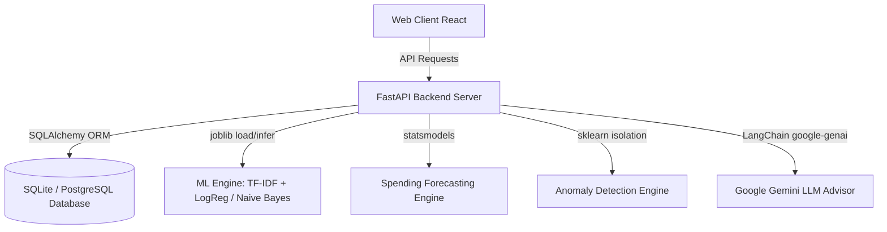

# AI-Powered Personal Finance & Budget Advisor

A complete, production-grade, highly-modern personal finance assistant and budget planner specifically optimized for student budgets (hostel rent, canteen meals, tuition, transport share splits) and general household cashflow. The project implements natural language processing for transaction categorization, statistical ARIMA time-series modeling for cashflow forecasts, Isolation Forest trees for anomaly flags, and Google Gemini LLMs for contextual financial advising.

---

## 🏗️ Architecture Design



---

## ⚡ Technical Stack

* **Frontend**: React.js (Vite), Tailwind CSS, Framer Motion, Recharts, Axios, React Router, Lucide Icons.
* **Backend**: FastAPI, Python, Uvicorn, SQLAlchemy ORM, Pydantic, Python-JWT.
* **Machine Learning**: Scikit-Learn, Statsmodels, Pandas, NumPy, Joblib.
* **Generative AI**: Google Gemini API, LangChain.
* **DevOps**: Docker, Docker Compose, PostgreSQL.

---

## 🤖 Machine Learning & NLP Models

1. **Expense Categorization**: Trains a dual text-classifier using a **TF-IDF Vectorizer** coupled with a **Logistic Regression** and **Multinomial Naive Bayes** pipeline to categorize transaction descriptions (e.g. Swiggy, Uber, Hostel Fee) into 10 custom expense categories with real-time confidence scores.
2. **Spending Forecasts**: Aggregates historic category-wise expenses resampled monthly, fitting a **SARIMAX/ARIMA** time-series model to output expected cashflows and 80% confidence bound limits for the next 3 months.
3. **Anomaly Alerts**: Fits an unsupervised **Isolation Forest** tree filter on amount, hour-of-transaction, and category codes, isolating outliers (severe spikes, late-night high-value swaps) with user-friendly risk percentage scores.
4. **AI Financial Advisor**: Passes aggregated category metrics, forecasted limits, and flagged anomalies to **Gemini 1.5** to generate structured, numbers-driven monthly financial tips.

---

## 📁 Repository Directory Structure

```
AI_BudgetAdvisor/
├── backend/
│   ├── app/
│   │   ├── services/
│   │   │   ├── ml_service.py       # Classification, Forecasting, and Isolation Forest
│   │   │   └── ai_service.py       # Gemini API & Offline Simulation
│   │   ├── config.py
│   │   ├── database.py
│   │   ├── auth.py
│   │   ├── models.py               # SQLAlchemy Database schemas
│   │   ├── schemas.py              # Pydantic validation models
│   │   └── main.py                 # Router routes, middleware, file uploads
│   ├── datasets/                   # Kaggle / Simulated target folder
│   ├── scripts/
│   │   ├── download_datasets.py    # Kaggle downloader / realistic dataset builder
│   │   └── train_models.py         # ML retraining pipeline
│   ├── Dockerfile
│   └── requirements.txt
├── frontend/
│   ├── src/
│   │   ├── components/
│   │   │   ├── Sidebar.jsx          # Smoke-glass navbar
│   │   │   └── GlassCard.jsx        # Glassmorphic panel containers
│   │   ├── pages/
│   │   │   ├── Login.jsx            # Dark authentication
│   │   │   ├── Dashboard.jsx        # Budget health meters & area trends
│   │   │   ├── Upload.jsx           # Drag-drop statement parser
│   │   │   ├── Analytics.jsx        # Interactive Bar/Pie Recharts
│   │   │   ├── Forecasting.jsx      # ARIMA forecast graphs
│   │   │   ├── AIAdvisor.jsx        # Interactive Gemini chat agent
│   │   │   ├── Anomalies.jsx        # Risk alerts dismiss/confirm cards
│   │   │   └── Admin.jsx            # Retrain triggers & diagnostic logs
│   │   ├── App.jsx                  # React routing guards
│   │   ├── main.jsx
│   │   └── index.css                # Smoke-glass style sheet
│   ├── tailwind.config.js
│   ├── vite.config.js
│   └── Dockerfile
├── docker-compose.yml
└── .env.example
```

---

## ⚡ Quick Start Setup Guide

### 1. Configure Secrets
Duplicate the `.env.example` file and save it as `.env`:
```bash
cp .env.example .env
```
Provide your `GEMINI_API_KEY` (if you want actual LLM responses instead of the highly intelligent simulated advisor).

### 2. Local Development Execution

#### Start FastAPI Backend
```bash
cd backend
pip install -r requirements.txt
python scripts/download_datasets.py    # Automatically builds pre-cleaned training datasets!
python scripts/train_models.py         # Trains the initial classifiers and anomaly forests!
uvicorn app.main:app --reload --port 8000
```

#### Start React Frontend
```bash
cd frontend
npm install
npm run dev
```
Open [http://localhost:5173](http://localhost:5173) in your browser.

### 3. Docker Compose Orchestration (Production Ready)
Launch the entire monorepo stack with a single command:
```bash
docker-compose up --build
```
This orchestrates:
- **PostgreSQL Database** on port `5432`
- **FastAPI backend** on port `8000`
- **React frontend** served via **Nginx** on port `80`

---

## 📡 API Reference Documentation

* `POST /api/auth/register` - Register a new user, auto-seeding standard budgets.
* `POST /api/auth/login` - Authenticate user, returns a secure JWT token.
* `POST /api/upload-transactions` - Upload bank statement CSV. Auto-triggers NLP categorization, anomaly detection, and budget spent updates.
* `POST /api/predict-category` - Get an instant NLP category prediction for a raw text snippet.
* `GET /api/analytics/summary` - Get monthly balance details, budget health scores, alerts, and cached AI insights.
* `GET /api/forecast/monthly` - Run ARIMA models and returns a 3-month forecast.
* `GET /api/anomalies` - Fetch risk alerts from the anomaly table.
* `PUT /api/anomalies/{id}` - Confirm or dismiss a flagged transaction anomaly.
* `POST /api/ai-advisor/chat` - Interactive text consultation with the financial AI.
* `GET /api/admin/metrics` - Fetch CPU/DB logs, category counts, and model accuracy for admins.
* `POST /api/admin/retrain` - Re-train all machine learning pipelines on live DB records.
