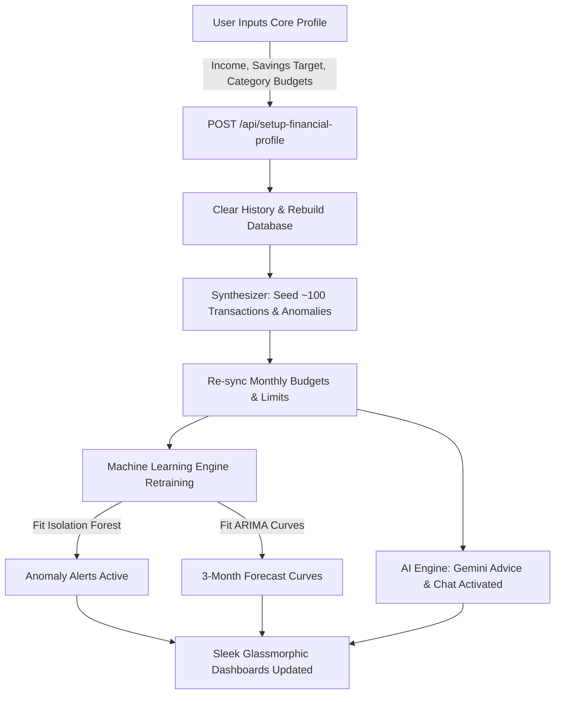

# TaskFlow Finance AI - Comprehensive User & Technical Guide

Welcome to **TaskFlow Finance AI**, a state-of-the-art interactive smart budget planner designed to help you realize your target savings. Unlike traditional finance apps that force you to link private bank accounts or upload complicated statement CSV sheets, TaskFlow offers a zero-authentication, instant-sandbox profile generator. 

By adjusting a few simple parameters, our advanced backend models automatically synthesize a high-fidelity transaction ledger, fit machine learning forecasting models, detect outliers, and generate highly targeted AI financial advice.

---

## 🌟 The Core Agenda

The fundamental mission of **TaskFlow Finance AI** is to make financial planning **frictionless, secure, and visually insightful**. 

* **Zero Signup / Login Friction**: Access the full sandbox instantly. No email verification or passwords required.
* **Instant Dynamic Simulation**: By adjusting your monthly income, savings targets, and category-wise variable allocations, the entire website dynamically scales, simulates, and recreates your entire financial footprint.
* **Proactive Outlier Monitoring**: Uses unsupervised ML to catch anomalous budget overruns before they ruin your savings goals.

---

## 🛠️ How TaskFlow Works: Step-by-Step

### 1. Step 1: The Profile Planner Form
You begin by entering three core inputs in the **Profile Planner**:
* **Monthly Net Income**: Your total available net income or stipend.
* **Savings Goal**: Your target savings target (the standard recommendation is 20% of net income). The planner calculates your available expense limit: 
  $$\text{Remaining Budget} = \text{Monthly Income} - \text{Savings Goal}$$
* **Category Budgets**: You distribute this remaining budget across ten real-life categories (*Food, Rent, Phone/Wifi Bills, Shopping, Transport, Education, Entertainment, Healthcare, Vacations, and Miscellaneous*).

### 2. Step 2: The Dynamic Transaction Synthesizer
Once you click **Apply & Generate Profile**, the FastAPI backend clears all past records and triggers a high-fidelity synthetic transaction engine that simulates a realistic 45-day history:
* **Deposit Seeding**: Creates a main monthly deposit representing your net income, alongside secondary freelance or gig incomes.
* **Expense Seeding**: Distributes over **100 realistic transactions** matching your category-wise spending targets.
* **Natural Contextual Descriptions**: Simulates actual transaction labels (e.g. *"Swiggy Delivery campus canteen"*, *"Netflix premium monthly subscription"*, *"Uber Auto ride"*) and allocates them across realistic timeframes and payment modes (UPI, Credit Cards, Cash, NetBanking).
* **Warning Anomalies**: Automatically seeds distinct warning outliers (such as an excessive midnight jeweler card transaction or a premium resort surcharge) to stress-test your risk monitors.

### 3. Step 3: Machine Learning Pipeline
As soon as the synthesizer finishes creating the transaction database, the backend automatically runs background ML training pipelines to align all forecasts and anomaly detectors with your specific lifestyle scale:
* **Isolation Forest (Unsupervised Outlier Detection)**:
  * Analyzes a multi-dimensional matrix of transaction variables (Amount, Time of Day, and Category).
  * Automatically calculates an **Anomaly Risk Score** (0% to 100%). Transactions exhibiting excessive value or irregular timestamps (such as large midnight card transactions) are flagged and routed to the **Anomaly Alerts** panel.
* **ARIMA Time-Series Spending Forecasts**:
  * Fits an AutoRegressive Integrated Moving Average model on the 45-day historical spending curve for each category.
  * Projects **3-month future spending curves** including upper and lower bounds. This visualizes whether your current category targets will result in budget overshoots.
* **NLP Category Predictor**:
  * Employs text-vectorization to automatically classify manual or incoming transaction descriptions into their proper category on the fly.

### 4. Step 4: Intelligent AI Recommendations (Gemini Core)
Once the database is synced and trained:
* TaskFlow invokes the **Gemini AI engine** to synthesize targeted financial advice.
* The model reviews your monthly income, category totals, and flagged risk anomalies.
* It populates your dashboard feed with 3-4 highly actionable savings recommendations (e.g. *"Your Shopping overruns are threatening your 20% savings target. Limiting clothing card spend by ₹3,000 will restore your target."*)
* Opens an interactive **AI Advisor chatbot** where you can ask complex questions like *"Create a custom meal-planning budget to save ₹1,500 on Food"* or *"How do my anomalies affect my monthly goals?"*. The advisor analyzes your active database metrics to answer.

---

## 🎨 Technology Stack

* **Backend API**: Python 3.x, FastAPI, SQLAlchemy ORM, SQLite database.
* **Data Science & ML**: Pandas, Scikit-Learn (Isolation Forest), Statsmodels (ARIMA), Joblib model serialization.
* **AI Engine**: Gemini Pro API (with an intelligent offline fallback simulator if the API key is absent).
* **Frontend Web App**: React 18, Vite HMR, Framer Motion (page animations), Recharts (responsive vector charts), Tailwind CSS, Lucide Icons.
* **Design Language**: **Midnight Oceanic / Emerald & Teal Obsidian**. High-contrast typography on deep obsidian-teal radial gradients, styled in sleek glassmorphic containers.

---

## 🏆 Key Benefits for the User

1. **100% Privacy-Preserved**: Your real-world banking credentials and actual bank statements never leave your device.
2. **Instant Sandbox Scenarios**: Want to see what happens if you double your income or slash entertainment spend? Just slide the sliders, apply, and watch the entire machine-learning dashboard adapt in real-time.
3. **Actionable Explanations**: Instead of throwing confusing raw transaction numbers at you, our ARIMA and anomaly models translate mathematical outliers into conversational alerts.

---
*TaskFlow Finance AI — Realize your target savings through smart, secure, simulated intelligence.*
