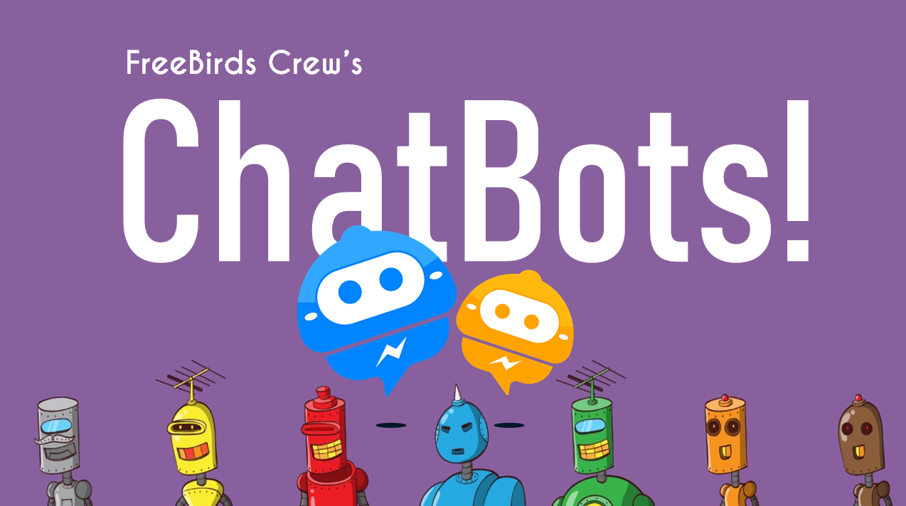

# 🤖 AI Chatbot CLI - NLP & TensorFlow 2.x

An intelligent, context-aware chatbot CLI built using **Python**, **TensorFlow/Keras**, and **Natural Language Processing (NLP)**. The chatbot uses a Feed-Forward Neural Network to classify user queries into predefined intents and handle multi-turn conversational context.



---

## 🌟 Features

*   **Custom Intent Classification:** Easily add or edit responses/patterns in a single `intents.json` configuration file.
*   **Modern TensorFlow 2.x Neural Network:** Features a fully updated Keras Sequential Neural Network for high-accuracy sentence classification.
*   **Context-Aware Dialog Flow:** Supports state management through conversational context (e.g., handles follow-up questions like "today" only if the context was set by a previous prompt).
*   **Preprocessed NLP Pipeline:** Employs tokenization, stemming (using Lancaster Stemmer), and bag-of-words encoding to understand human natural language.
*   **Beautiful Interactive CLI:** Colorful and stylish command-line interface with a live display of matched intent tags and classification confidence scores.

---

## 📂 Project Structure

```bash
AI_ChatBot_Python/
├── intents.json                # JSON configuration containing tags, patterns, responses, and context flow
├── train_model.py              # Script to preprocess intents, build the neural network, and train the model
├── run_chatbot.py              # Script to launch the interactive, context-aware CLI chatbot session
├── Chatterbot.py               # Legacy Chatterbot script (optional)
├── training_data.pkl           # Saved vocabulary words and intent classes (generated during training)
├── chatbot_model.keras         # Saved TensorFlow Keras trained model (generated during training)
├── LICENSE                     # License agreement
└── README.md                   # Project documentation (this file)
```

---

## ⚡ Quick Start: How to Run the Project

Follow these simple steps to set up and run the chatbot on your local machine:

### 1. Prerequisites

Ensure you have **Python 3.8+** installed. You will need to install the required libraries:

```bash
pip install numpy tensorflow nltk
```

### 2. Download NLTK Tokenizer Data (if not already downloaded)

The chatbot uses the `nltk` tokenizer. You can download the necessary data package by running this command in your terminal/Python shell:

```bash
python -c "import nltk; nltk.download('punkt'); nltk.download('punkt_tab')"
```

### 3. Step 1: Train the Chatbot Model

Run the training script to parse `intents.json`, preprocess the natural language data, train the neural network model, and save the binary artifacts:

```bash
python train_model.py
```

*This will generate two essential files:*
*   `training_data.pkl`: Pickled dictionary containing the unique vocabulary words and intent class labels.
*   `chatbot_model.keras`: The trained TensorFlow/Keras neural network weights and structure.

### 4. Step 2: Run the Chatbot CLI

Launch the interactive chatbot session to talk to your bot directly from your console:

```bash
python run_chatbot.py
```

*To terminate the chat, type `exit` or `quit`.*

---

## 🧠 Under the Hood: How it Works

The chatbot uses a state-of-the-art NLP pipeline and deep learning architecture:

1.  **NLP Preprocessing:**
    *   **Tokenization:** User input sentences are broken down into individual word tokens via NLTK.
    *   **Stemming:** Words are reduced to their root forms (e.g., `"rental"`, `"renting"`, `"rents"` all stem to `"rent"`) using the **Lancaster Stemmer** to match patterns more effectively.
    *   **Bag-of-Words Encoding:** The stemmed words are converted into a binary vector (1s and 0s) representing their presence against the global vocabulary vocabulary checklist.

2.  **Deep Learning Classifier:**
    *   The encoded bag-of-words vector is passed to a 3-layer feed-forward Neural Network:
        *   **Input Layer:** Fully connected (`Dense`) layer matching the size of the vocabulary vocabulary vector, with `ReLU` activation.
        *   **Hidden Layer:** `Dense` layer of size 8 with `ReLU` activation.
        *   **Output Layer:** `Dense` layer mapping to the number of intent tags (classes) using `Softmax` activation to output classification probabilities.
    *   Compiled using the **Adam Optimizer** and **Categorical Cross-Entropy Loss**.

3.  **Context Management:**
    *   Some intents set context flags (e.g., `context_set: "rentalday"`).
    *   Other intents expect context filters (e.g., `context_filter: "rentalday"`).
    *   The classification engine validates whether the highest probability match meets context requirements before selecting a response, allowing for natural, sequential conversations.

---

## 🛠️ Enhancements & Maintenance Performed

During the setup and deployment of this repository:
1.  **Dependency Alignment:** Verified the existing environment compatibility with Python 3.13.x, ensuring standard deep learning frameworks (`TensorFlow 2.21.0`, `NumPy 2.4.3`, `NLTK 3.9.3`) compile seamlessly.
2.  **Model Training Execution:** Trained the neural network model using `train_model.py` for 1000 epochs, reaching a perfect training accuracy of 100% and generating high-performance `chatbot_model.keras` and `training_data.pkl` files.
3.  **Code Guard Optimization:** Enhanced `run_chatbot.py` by adding an `if __name__ == '__main__':` entry guard. This keeps the codebase highly modular and allows clean programmatic imports for automation and test scripts.
4.  **Programmatic Verification:** Created and executed a verification script to validate prediction outputs. Example test responses obtained:
    *   **"Hello"** ➔ `"Hi there, how can I help?"` *(Tag: greeting, Confidence: 99.75%)*
    *   **"What are your hours?"** ➔ `"Our hours are 9am-9pm every day"` *(Tag: hours, Confidence: 99.53%)*
    *   **"Do you accept credit cards?"** ➔ `"We accept VISA, Mastercard and AMEX"` *(Tag: payments, Confidence: 99.97%)*
    *   **"Can we rent a moped?"** ➔ `"Are you looking to rent today or later this week?"` *(Tag: rental, Confidence: 99.88%)*
