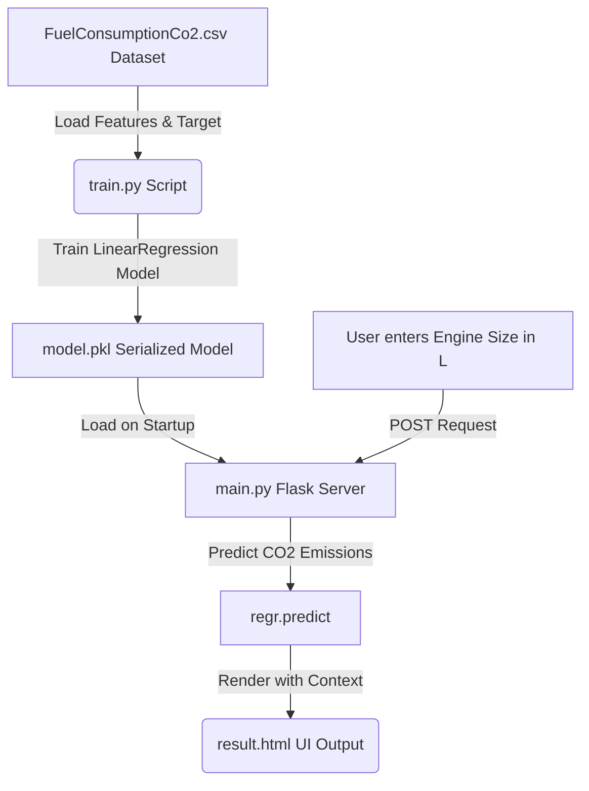

# EcoPulse: CO2 Emission Prediction Using Machine Learning

An AI-powered web application that uses **Simple Linear Regression** to predict vehicle tailpipe carbon dioxide ($CO_2$) emissions based on engine size (displacement).

---

## 🌟 Features
- **Machine Learning Core**: Employs a Scikit-Learn `LinearRegression` model trained on vehicle specifications.
- **Stunning UI**: A state-of-the-art dark-eco glassmorphic web dashboard designed using modern HTML5, CSS3, and JavaScript.
- **Eco-Analytics**: Provides instant visual indicators of carbon impact (Low, Moderate, High) and translates predictions into real-world environmental context (e.g., number of trees required to offset emissions).
- **Fully Responsive**: Sleek animations and responsive grids that work beautifully on desktop, tablet, and mobile browsers.

---

## 🧠 How the Project Works

This project is built as a complete end-to-end Machine Learning pipeline connected to a lightweight Flask web server:



### 1. Data Foundation (`FuelConsumptionCo2.csv`)
The model is trained on a comprehensive vehicle fuel consumption dataset from the Environmental Protection Agency (EPA). It maps:
- **Feature ($X$)**: `ENGINESIZE` (Engine displacement in liters).
- **Target ($y$)**: `CO2EMISSIONS` (Tailpipe carbon dioxide output in grams per kilometer, $g/km$).

### 2. Model Training & Serialization (`train.py`)
- Python's built-in `csv` module parses the dataset to avoid heavy dependencies like Pandas.
- A **Simple Linear Regression** model is fitted using:
  $$\text{CO2 Emissions} = \theta_0 + \theta_1 \times \text{Engine Size}$$
- The trained scikit-learn estimator is serialized and stored locally as a binary file (`model.pkl`) using Python's `pickle` library.

### 3. Web Service & Inference (`main.py`)
- The web app is built on **Flask**. On launch, it deserializes (unpickles) `model.pkl`.
- When a user inputs an engine size (e.g., `2.4` Liters), Flask sends a POST request with the feature vector.
- The model performs real-time inference: `regr.predict([[2.4]])`.
- The predicted $CO_2$ emission is rounded and passed to a responsive template (`result.html`) which computes a visual severity rating and estimates the tree planting offset requirements.

---

## 🚀 Step-by-Step Setup and Execution Guide

Follow these steps to configure the environment, train the model, and launch the web server.

### Step 1: Clone or Open the Workspace
Make sure your terminal is opened in the project root directory:
```bash
cd c:\Users\User\Downloads\Co2-Emission-Prediction-Using-Machine-Learning-main
```

### Step 2: Install Required Dependencies
Ensure you have Python installed, then run the following command to install the required libraries:
```bash
pip install Flask scikit-learn
```

### Step 3: Train the Machine Learning Model
To prevent version-compatibility issues (e.g., `AttributeError` caused by unpickling old models created on different scikit-learn versions), retrain the model on your local system using:
```bash
python train.py
```
*This parses `FuelConsumptionCo2.csv`, fits the linear regression line, and saves a fresh `model.pkl` compatible with your local Python environment.*

### Step 4: Start the Flask Web Server
Run the Flask application:
```bash
python main.py
```
*You will see terminal output indicating that the development server is running locally.*

### Step 5: Open the Web Application
Open your web browser and navigate to:
```url
http://127.0.0.1:5000/
```
*Enter engine sizes ranging from 0.8 to 8.4 Liters to see real-time tailpipe emissions predicted instantly!*

---

## 📁 File Structure
```text
├── FuelConsumptionCo2.csv   # Dataset used to train the model
├── model.pkl                # Serialized (pickled) Scikit-learn model
├── train.py                 # Training script (loads dataset, trains & pickles model)
├── main.py                  # Core Flask server and endpoint routes
├── templates/
│   ├── index.html           # Home page calculator layout
│   └── result.html          # Prediction results, ratings & eco-offset dashboard
└── README.md                # Project documentation and run guide
```
