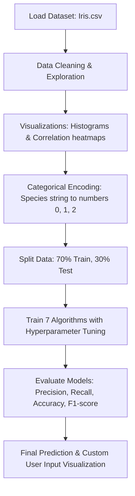

# Iris Flower Classification using Machine Learning

An end-to-end Machine Learning project developed to classify Iris flowers into their respective species based on physical dimensions. This project was developed as part of the Oasis Infobyte Summer Internship Program.

---

## 📌 Project Overview & Goal

The **Iris Flower** is a genus of plants consisting of multiple species. The three primary species studied in this project are:
*   **Iris setosa**
*   **Iris versicolor**
*   **Iris virginica**

These species look very similar but differ in their physical leaf measurements. The objective of this project is to develop and train a machine learning model capable of automating the classification process based on these characteristics.

### 📐 Physical Measurements Used (Features)
*   **Sepal Length** (in cm)
*   **Sepal Width** (in cm)
*   **Petal Length** (in cm)
*   **Petal Width** (in cm)

---

## ⚙️ How the Project Works

The workflow of the project is implemented across data exploration, model training, evaluation, and user predictions:



1.  **Exploratory Data Analysis (EDA):** Visualizing distributions and relationships using scatter plots and histograms. A key finding is that **Iris-setosa** has distinctly smaller petals compared to the other two species, making it easily distinguishable.
2.  **Preprocessing:** Categorical variables (species names) are encoded into numeric values (`0 = Iris-setosa`, `1 = Iris-versicolor`, `2 = Iris-virginica`) using `LabelEncoder`.
3.  **Model Training & Cross-Validation:** Data is split into 70% training and 30% testing sets. Models are cross-validated using `RepeatedStratifiedKFold`.
4.  **Hyperparameter Optimization:** Using `GridSearchCV` and `RandomizedSearchCV` to find the best configuration parameters for each model to optimize recall and prevent overfitting.
5.  **Custom Prediction & Visual Mapping:** Taking custom measurements from the user, classifying it, and plotting a red star on a scatter plot representing where the custom entry lies relative to historical data.

---

## 🤖 Machine Learning Models Used

This project evaluates and compares **14 different model variations** (baseline and tuned versions of 7 distinct algorithms):

1.  **Logistic Regression:** A linear classification algorithm that maps probabilities using a logistic function.
2.  **Decision Tree Classifier:** A tree-structured model that splits data based on simple decision rules.
3.  **Random Forest Classifier:** An ensemble method that trains multiple decision trees to improve accuracy and control overfitting.
4.  **Support Vector Classifier (SVC):** Finds a hyperplane in a high-dimensional space that maximizes separation between classes.
5.  **Extreme Gradient Boosting (XGBoost):** An efficient, optimized gradient boosting decision tree framework.
6.  **Naive Bayes Classifier (GaussianNB):** A probabilistic classifier based on Bayes' Theorem, assuming independence between features.
7.  **Neural Network (MLP Classifier):** A Multi-layer Perceptron neural network consisting of input, hidden, and output layers.

---

## 📈 Model Performance Summary

After evaluating all models on the test set, the tuned **Neural Network** and **Support Vector Machine (SVM)** achieved the highest accuracy and recall on the test set. 

Here is the accuracy overview across the models:

| Machine Learning Model | Baseline Accuracy (Test Set) | Tuned Accuracy (Test Set) |
| :--- | :---: | :---: |
| **Logistic Regression** | **95.56%** | **95.56%** |
| **Decision Tree** | **95.56%** | **91.11%** |
| **Random Forest** | **95.56%** | **88.89%** |
| **Support Vector Machine (SVM)** | **95.56%** | **95.56%** |
| **XGBoost** | **91.11%** | **93.33%** |
| **Naive Bayes** | **93.33%** | **93.33%** |
| **Neural Network (MLP)** | **95.56%** | **95.56%** |

> [!TIP]
> While some baseline models show 100% training accuracy, they are **overfitted** (memorized the training data). Tuned versions (like tuned Random Forest or Naive Bayes) generalize much better to new, unseen data.

---

## 🚀 Setup & Execution Guide

### Prerequisites
Make sure you have **Python 3.10+** installed on your system. 

### 1. Installation & Environment Setup
Open your terminal inside the project directory and install the required dependencies:

```bash
pip install pandas numpy scikit-learn seaborn matplotlib xgboost
```

### 2. Running as an Interactive Jupyter Notebook
If you want to step through the data analysis, plots, and training code interactively:
1.  Open VS Code and install the **Jupyter** extension.
2.  Open [Iris_Flower_Classification.ipynb](file:///C:/Users/User/Downloads/oibsip_taskno1-main/oibsip_taskno1-main/Iris_Flower_Classification.ipynb).
3.  Select your Python environment kernel in the top-right corner.
4.  Click **Run All**.

### 3. Running as a Clean Console Python Script
If you want to run the model pipeline and get an instant prediction on a custom flower:
1.  Open the [Iris_Flower_Classification.py](file:///C:/Users/User/Downloads/oibsip_taskno1-main/oibsip_taskno1-main/Iris_Flower_Classification.py) file.
2.  Change your input flower measurements inside the array on **Line 1197**:
    ```python
    x_rf = np.array([[5.1, 3.5, 1.4, 0.2]]) # [SepalLength, SepalWidth, PetalLength, PetalWidth]
    ```
3.  Open your terminal and run the script:
    ```bash
    python Iris_Flower_Classification.py
    ```
4.  **Expected Output:** All intermediate diagnostics and plots are suppressed during training. The console will run silently for about 1-2 minutes and then output a clean box:
    ```text
    ==================================================
    YOUR INPUT FLOWER: [5.1 3.5 1.4 0.2]
    MODEL USED: Random Forest (Tuned)
    PREDICTED SPECIES: Iris-Setosa
    MODEL ACCURACY (TEST SET): 97.78%
    ==================================================
    ```
5.  Following the text output, a single graphical window will pop up showing where your custom flower lies as a **red star** relative to the historical Setosa, Versicolor, and Virginica clusters.
