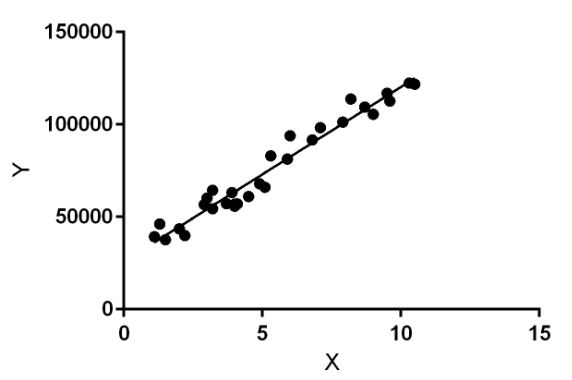
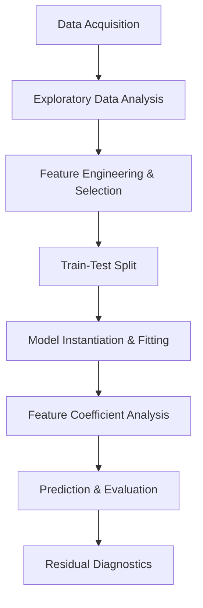

# 🏡 USA Housing Price Prediction — Linear Regression Model

[](https://www.python.org/)
[](https://scikit-learn.org/)
[](https://pandas.pydata.org/)
[](https://numpy.org/)
[](https://seaborn.pydata.org/)

An end-to-end Machine Learning project to build a **Multiple Linear Regression Model** that predicts house prices in various regions of the United States. This project walks through the entire data science pipeline: from Exploratory Data Analysis (EDA) and data preprocessing to model training, evaluation, predictions, and diagnostic checks.

---

## 📸 Model Visual Overview

Below is the conceptual linear regression illustration depicting feature relationships with the dependent target variable (`Price`):



---

## 🎯 Problem Statement

A real estate agency in the USA wants to leverage data-driven pricing models to estimate what houses in specific regions would sell for. They provided a dataset containing housing profiles and historical sales price data. 

**Objective:** Build a robust, accurate predictive regression model to help agents estimate regional house prices based on various structural and demographic parameters.

---

## 📊 Dataset & Features

The dataset (`USA_Housing.csv`) contains **5,000 observations** (rows) and **7 attributes** (columns):

| Feature Name | Description | Data Type |
| :--- | :--- | :--- |
| **`Avg. Area Income`** | Average income of householders in the city where the house is located. | Float |
| **`Avg. Area House Age`** | Average age of houses in the same city. | Float |
| **`Avg. Area Number of Rooms`** | Average number of rooms for houses in the same city. | Float |
| **`Avg. Area Number of Bedrooms`** | Average number of bedrooms for houses in the same city. | Float |
| **`Area Population`** | Population of the city where the house is located. | Float |
| **`Price`** | **Target Variable:** The sale price of the house (in USD). | Float |
| **`Address`** | The full alphanumeric address of the house (Ignored during modeling). | Object / Text |

> [!NOTE]
> The target variable `Price` is continuous, making this a classic **Supervised Regression Task**.

---

## ⚙️ Data Science Pipeline



### 1. Exploratory Data Analysis (EDA)
Comprehensive visual exploration was conducted to understand distribution shapes, outliers, and multicollinearity:
* **Descriptive Statistics**: Inspected distributions, bounds, averages, and missing values (`HouseDF.info()`, `HouseDF.describe()`).
* **Correlation Heatmap**: Utilized `sns.heatmap(HouseDF.corr(), annot=True)` to assess pairwise linear relationships between variables.
* **Pairwise Visualizations**: Plotted `sns.pairplot(HouseDF)` to visualize joint distributions and spot patterns.
* **Target Distribution**: Plotted `sns.distplot(HouseDF['Price'])` which revealed that the housing price is normally distributed around a mean of ~$1.23M.

### 2. Feature Selection & Train-Test Split
* **Feature Filtering**: Dropped `'Price'` (as it is the target variable) and `'Address'` (due to its high cardinality and textual nature).
* **Train-Test Partition**: Segmented the data into training and testing portions using `train_test_split` with a **60/40 split** to ensure a strong test evaluation dataset:
  ```python
  X_train, X_test, y_train, y_test = train_test_split(X, y, test_size=0.4, random_state=101)
  ```

### 3. Model Training & Parameter Estimation
A **Multiple Linear Regression** model was fitted to the training split:
$$Price = \beta_0 + \beta_1(Income) + \beta_2(House Age) + \beta_3(Rooms) + \beta_4(Bedrooms) + \beta_5(Population) + \epsilon$$
```python
from sklearn.linear_model import LinearRegression
lm = LinearRegression()
lm.fit(X_train, y_train)
```

---

## 📈 Model Interpretation & Coefficients

By evaluating the coefficients ($\beta_i$) of the trained model, we can quantify the impact of each independent variable on the house price (holding all other variables constant):

| Feature Name | Coefficient ($\beta$) | Interpretability (Impact on Price) |
| :--- | :--- | :--- |
| **Avg. Area Income** | **$21.53** | Each single dollar ($1.00) increase in average area income increases the house value by **$21.53**. |
| **Avg. Area House Age** | **$164,883.28** | Each additional year of average house age in the area increases the house value by **$164,883.28**. |
| **Avg. Area Number of Rooms** | **$122,368.68** | Each additional room on average increases the house value by **$122,368.68**. |
| **Avg. Area Number of Bedrooms** | **$2,233.80** | Each additional bedroom on average increases the house value by only **$2,233.80**. |
| **Area Population** | **$15.15** | Each additional citizen in the area population increases the house value by **$15.15**. |

> [!TIP]
> **Avg. Area House Age** and **Avg. Area Number of Rooms** are the most powerful predictors on a per-unit basis, whereas **Avg. Area Number of Bedrooms** has a negligible direct effect compared to the overall room count.

---

## 📊 Model Predictions & Diagnostics

### Actual vs. Predicted Prices
Plotted a scatter plot comparing actual test labels (`y_test`) against predicted values (`predictions`):
* The data points align closely along a straight diagonal line ($y = x$), showcasing **extremely precise predictions** and confirming a highly generalized fit.

### Residual Distribution Analysis
Plotted the residual error distribution: `y_test - predictions`:
* The error residuals exhibit a **perfect bell curve (Normal Distribution)** centered exactly at zero.
* This validates the classical regression assumption of normally distributed error terms with a mean of zero ($\epsilon \sim N(0, \sigma^2)$), confirming that the model did not miss structural non-linear trends.

---

## 🧪 Regression Evaluation Metrics

The performance of the model on unseen test data was evaluated using three standard regression metrics:

* **Mean Absolute Error (MAE)** measures the average magnitude of absolute errors:
  $$\text{MAE} = \frac{1}{n} \sum_{i=1}^n |y_i - \hat{y}_i|$$
* **Mean Squared Error (MSE)** penalizes larger errors by squaring them:
  $$\text{MSE} = \frac{1}{n} \sum_{i=1}^n (y_i - \hat{y}_i)^2$$
* **Root Mean Squared Error (RMSE)** converts the error metric back to the target unit (USD) for easier business interpretation:
  $$\text{RMSE} = \sqrt{\frac{1}{n} \sum_{i=1}^n (y_i - \hat{y}_i)^2}$$

### Model Performance Metrics Summary:
* **MAE**: `$82,288.22`
* **MSE**: `10,460,958,907.21`
* **RMSE**: **`$102,278.83`**

Given the average housing price is over **$1,230,000**, an RMSE of **$102,278** represents less than a **~8.3% error rate**, demonstrating a highly accurate and dependable model for business and valuation use cases.

---

## 🚀 Getting Started

### Prerequisites
Make sure you have Python 3.7+ installed. You can install all dependencies via `pip`:
```bash
pip install pandas numpy seaborn matplotlib scikit-learn jupyter
```

### Running the Project
1. Clone this repository to your local system:
   ```bash
   git clone https://github.com/your-username/Linear-Regression-Model-for-House-Price-Prediction.git
   ```
2. Navigate to the project directory:
   ```bash
   cd Linear-Regression-Model-for-House-Price-Prediction
   ```
3. Launch Jupyter Notebook:
   ```bash
   jupyter notebook
   ```
4. Open and run all cells in `Linear Regression Model.ipynb` to train the model, perform EDA, and verify metrics.

---

## 🛠️ Tech Stack Used

- **Language:** Python
- **Libraries:** Pandas, NumPy, Scipy
- **Visualization:** Seaborn, Matplotlib
- **Machine Learning:** Scikit-Learn
- **Environment:** Jupyter Notebook

---
*Created as a comprehensive tutorial on Multiple Linear Regression implementation using Python & Scikit-Learn.*
