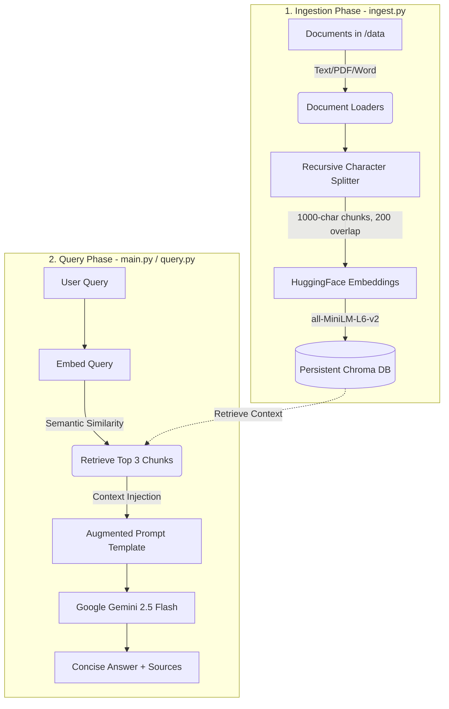

# 🧠 LangChain & Gemini RAG Pipeline (TaskFlow)

An advanced, local **Retrieval-Augmented Generation (RAG)** pipeline built with **LangChain**, **Google Gemini (gemini-2.5-flash)**, **Chroma DB**, and local **HuggingFace Embeddings**. 

This system allows you to ingest documents (PDFs, Word files, and plain text), vectorize them locally, and ask questions about your data in a secure, extremely fast, and highly accurate interactive terminal interface.

---

## 🗺️ System Architecture

The pipeline consists of two main workflows: **Document Ingestion (Offline)** and **Retrieval & Question Answering (Online)**.



---

## ⚡ Key Features

*   **Multi-Format Document Loader:** Seamlessly parses and processes `.txt` (Plain Text), `.pdf` (Portable Document Format), and `.docx` / `.doc` (Microsoft Word) files from a local directory.
*   **Local Embedding Generation:** Uses HuggingFace's `all-MiniLM-L6-v2` transformer model to convert text chunks into high-dimensional vector embeddings entirely on your local machine.
*   **Vector Database Storage:** Leverages Chroma DB to persist vector embeddings and document chunks locally in the `chroma_db/` folder, allowing for lightning-fast semantic searches without re-indexing.
*   **State-of-the-Art LLM Reasoning:** Utilizes Google's `gemini-2.5-flash` model through the `langchain-google-genai` integration for fast, context-aware, and precise answers.
*   **Dual Interaction Interfaces:**
    *   **Single-shot CLI Utility (`query.py`):** Instantly query the pipeline with a single command line argument.
    *   **Interactive Terminal Chat (`main.py`):** Chat continuously with your documents in an interactive session with automatic database checks and automatic document ingestion.
*   **DB Health Inspector (`view.py`):** A utility script to view chunk statistics, metadata, and verify contents stored inside your database.

---

## 📂 Project Directory Structure

```text
RAG_Pipeline/
│
├── data/                  # 📂 Put your source files here (.txt, .pdf, .docx, .doc)
├── chroma_db/             # 🗄️ Auto-generated persistent vector database (Chroma DB)
│
├── main.py                # 🚀 Main entry point - Interactive Chatbot with Auto-ingestion
├── ingest.py              # 📥 Document Loader, Chunk Splitter, Embedding Generator & DB creator
├── query.py               # 🔍 CLI single-shot query runner
├── view.py                # 🔬 DB Inspector to view database stats and sample chunks
│
├── .env                   # 🔑 Environment variables containing Gemini API Key
├── requirements.txt       # 📦 Project dependencies
└── README.md              # 📖 Project documentation (This file)
```

---

## 🛠️ Prerequisites & Setup

### 1. Clone or Open the Project
Ensure you are in the project folder:
```bash
cd c:/Users/User/Downloads/RAG_Pipeline
```

### 2. Set Up a Virtual Environment
Create and activate a virtual environment to keep dependencies isolated:
```powershell
# Create venv
python -m venv venv

# Activate venv (PowerShell)
.\venv\Scripts\Activate.ps1

# Activate venv (Command Prompt)
.\venv\Scripts\activate.bat
```

### 3. Install Dependencies
Install all the required Python libraries:
```bash
pip install -r requirements.txt
```

### 4. Configure Environment Variables
Create a file named `.env` in the root of the project (if it doesn't already exist) and add your Google Gemini API key:
```env
GEMINI_API_KEY=your_actual_gemini_api_key_here
```
> ⚠️ **Note:** Make sure you do not commit your `.env` file containing the API Key to version control systems like GitHub.

---

## 🚀 How to Run the Project

### Phase 1: Ingesting Documents (Optional, Auto-run supported)
Place your target files (`.pdf`, `.txt`, `.docx`) inside the `data/` folder. 
Run the ingestion script to process the documents and build the vector database:

```bash
python ingest.py
```

*What happens under the hood?*
1. Reads all files in the `data/` directory.
2. Splits documents into **1000-character chunks** with a **200-character overlap** (retains context continuity across boundaries).
3. Converts text chunks to 384-dimensional vector embeddings using the `all-MiniLM-L6-v2` model.
4. Stores vectors and text in a local `chroma_db` database folder.

---

### Phase 2: Interacting with the RAG Pipeline

#### Option A: Interactive Chat Mode (Recommended)
Launch a continuous chatbot interface in your terminal. If the database doesn't exist yet, it automatically ingests documents for you!

```bash
python main.py
```

**Interface Example:**
```text
Vector database not found at 'chroma_db'. Running ingestion first...
Loading documents from data...
Loaded 2 document(s).
Split documents into 15 chunks.
Saving vectors to chroma_db...
Ingestion complete! Database is ready.

==================================================
Welcome to your RAG Chatbot!
Type your questions below. Type 'exit' or 'quit' to close the program.
==================================================

User: What is the company policy on annual leaves?

Bot (Thinking)...

Answer:
The company policy allows for 20 days of paid annual leave per calendar year. Employees must request leaves at least two weeks in advance through the HR portal. Unused leaves do not roll over to the next year.

Sources used:
 - data\employee_handbook.pdf

--------------------------------------------------
```

#### Option B: Single CLI Command
Run a quick query from your terminal and exit immediately:

```bash
python query.py "What are the key requirements for project approval?"
```

---

### Phase 3: Inspecting Database Health
Use `view.py` to check if documents were vectorized correctly and see what a stored chunk looks like:

```bash
python view.py
```

---

## ⚙️ Technical Blueprint & Configurations

| Component | Technology | Configurations / Parameter |
| :--- | :--- | :--- |
| **Document Loaders** | LangChain Community Loaders | `TextLoader` (UTF-8), `PyPDFLoader`, `Docx2txtLoader` |
| **Text Splitter** | `RecursiveCharacterTextSplitter` | `chunk_size = 1000`, `chunk_overlap = 200` |
| **Embeddings** | `HuggingFaceEmbeddings` | Model: `all-MiniLM-L6-v2` (384 Dimensions) |
| **Vector DB** | `Chroma` | Persistent Directory: `chroma_db/`, Search: `Top 3 chunks (k=3)` |
| **LLM Provider** | Google Generative AI | Model: `gemini-2.5-flash`, `temperature = 0` (Deterministic) |
| **Prompt Template** | `ChatPromptTemplate` | Restricts responses to maximum 3 sentences & strictly retrieved context |

---

## 🛡️ Troubleshooting

1. **Error: `Vector database not found` or `Please add some text, PDF, or Word files.`**
   * Make sure you have created the `data/` folder and added at least one valid `.txt`, `.pdf`, or `.docx` file in it before running.
2. **Error: `Please set your GEMINI_API_KEY in the .env file.`**
   * Double check that you created the `.env` file in the root folder, and that the key name is exactly `GEMINI_API_KEY` with a valid, active API key from Google AI Studio.
3. **Slow First Ingestion:**
   * During the first execution, `HuggingFaceEmbeddings` will download the `all-MiniLM-L6-v2` model weights (approx. 90MB) to your machine. Subsequent runs will use the cached local version and run instantly.
