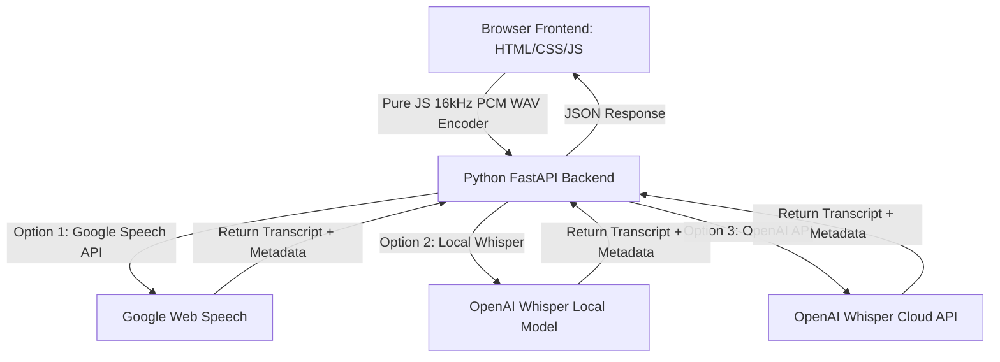

# VoiceFlow — Advanced Voice to Text Suite

VoiceFlow is a high-fidelity, interactive, and visually stunning local web application that transcribes voice files and real-time microphone recordings into text. Underpinned by a lightweight **FastAPI** backend and an elegant, glassmorphic **single-page frontend**, VoiceFlow integrates multiple world-class transcription engines into a unified local workspace.

---

## 🌟 Features

*   **Interactive Real-Time Recording**: Speak directly into your microphone and watch a canvas visualizer render animated audio waveforms.
*   **Drag-and-Drop Audio Uploads**: Drag in WAV, MP3, M4A, or FLAC files up to 25MB for immediate processing.
*   **Three Transcription Engines**:
    1.  **Google Speech Recognition** (Default, completely free, unlimited, no setup required).
    2.  **Local Whisper Model** (100% offline, private CPU/GPU transcription utilizing OpenAI's lightweight `tiny` model).
    3.  **OpenAI Whisper Cloud API** (Ultra-accurate cloud-based translation, processed via your secure API key).
*   **Aesthetic Analytics Dashboard**: View comprehensive insights for every transcription, including audio duration, word count, processing latency, and estimated speaking speed (WPM).
*   **Rich Actions Control**: Instantly copy transcripts to the clipboard or export them as structured plain-text (`.txt`) or data-focused JSON (`.json`) files.

---

## 🛠️ Technical Architecture



### 1. Pure Browser-Side WAV Downsampling
Standard microphone streams output heavy, platform-specific compressed formats. VoiceFlow runs a **Float32-to-16-bit PCM downsampler** directly inside your browser's Web Audio API. It encodes your voice as a lightweight **16,000 Hz Mono WAV** stream, allowing instant uploads and zero conversion latency on the server.

### 2. Auto-Configured Static FFmpeg & FFprobe
Voice-to-text libraries and audio decoders (like `pydub` and `whisper`) depend heavily on underlying `ffmpeg` binaries. VoiceFlow bundles **`static-ffmpeg`** in its environment requirements, automatically injecting high-speed `ffmpeg` and `ffprobe` binaries into your PATH on startup. No manual Windows global installers are needed!

### 3. Port-Isolated Bindings
The application runs on **port 8001** to completely bypass any duplicate background service socket conflicts (`SO_REUSEADDR`) on port 8000, ensuring a smooth connection on Windows.

---

## 🚀 Step-by-Step Running Guide

Follow these simple steps to run VoiceFlow on your local Windows system:

### 1. Navigate to the Project Folder
Open your terminal (PowerShell or Command Prompt) and ensure you are in the project workspace:
```powershell
cd "c:\Users\User\Downloads\Voice to Text"
```

### 2. Set Up a Python Virtual Environment (Highly Recommended)
Create a clean, isolated virtual environment to avoid package conflicts:
```powershell
python -m venv .venv
```

### 3. Activate the Virtual Environment
Activate the environment to start using local executables:
*   **PowerShell**:
    ```powershell
    .venv\Scripts\Activate.ps1
    ```
*   **Command Prompt (cmd)**:
    ```cmd
    .venv\Scripts\activate.bat
    ```

### 4. Install dependencies
Install all required backend packages and bundled ffmpeg utilities:
```powershell
pip install -r requirements.txt
```

### 5. Start the Server
Launch the FastAPI development server:
```powershell
python app.py
```
*Note: The server will dynamically download the lightweight static binaries and print the confirmation:*
```text
[VoiceFlow] Successfully configured static ffmpeg and ffprobe paths via static-ffmpeg.
INFO: Uvicorn running on http://127.0.0.1:8001 (Press CTRL+C to quit)
```

### 6. Transcribe!
*   Open your web browser and navigate to: **[http://127.0.0.1:8001](http://127.0.0.1:8001)**.
*   Record from your microphone or drag and drop an MP3/WAV file.
*   Choose your transcription engine and click **Transcribe**!

---

## ⚙️ Configuration & Engines

*   **Google Speech API**: Works instantly, free, zero keys needed.
*   **Whisper Local Model**: Downloads the ~70MB local model (`tiny`) on your first run. Transcription takes place fully offline on your own machine.
*   **OpenAI Whisper Cloud**: Expand the "Engine Settings" card, choose "OpenAI Whisper API", paste your secure API key (`sk-proj-...`) in the password field, and run. (Keys are never saved to the server and exist only inside the active browser request context).
